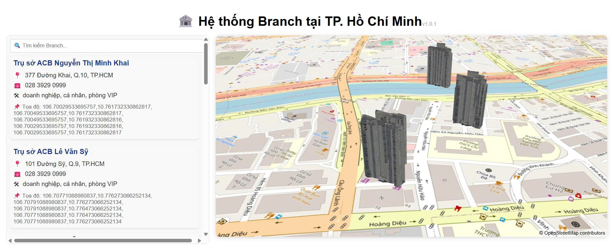
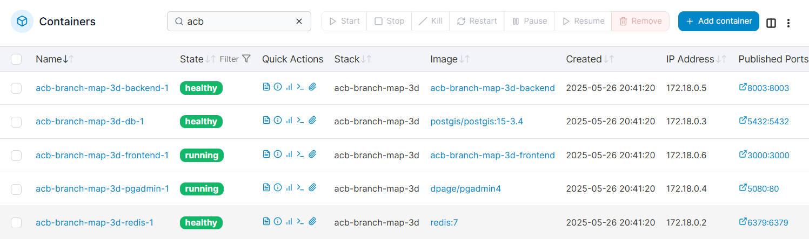

# 📘 Project Overview:ACB Bank Branch Map 3D Visualization

## 🚀 Purpose

An interactive 3D map-based web application for visualizing ACB bank branch locations in Vietnam using 3D building models and real-time data interaction. Designed for internal dashboard use or public visualization.

---

## 🧱 Tech Stack

| Layer            | Technology                               |
| ---------------- | ---------------------------------------- |
| Frontend         | React + MapLibre GL JS + Three.js        |
| Backend          | Node.js / Express (optional API serving) |
| Data             | PostgreSQL + PostGIS                     |
| Containerization | Docker / Docker Compose                  |
| Model Loader     | GLTFLoader (three.js)                    |
| Styles           | CSS Modules or Tailwind (optional)       |

---

## 🗂️ Project Structure

```bash
branch-map-project/
├── backend/
│   ├── branch_map/
│   │   ├── __init__.py
│   │   ├── settings.py
│   │   ├── urls.py
│   │   ├── wsgi.py
│   │   ├── asgi.py
│   ├── apps/
│   │   ├── __init__.py
│   │   ├── branchs/
│   │   │   ├── __init__.py
│   │   │   ├── models.py
│   │   │   ├── serializers.py
│   │   │   ├── views.py
│   │   │   ├── urls.py
│   │   │   ├── admin.py
│   │   │   ├── management/
│   │   │   │   ├── commands/
│   │   │   │   │   ├── import_branchs.py
│   │   │   ├── migrations/
│   ├── manage.py
│   ├── requirements.txt
│   ├── Dockerfile
├── frontend/
│   ├── src/
│   │   ├── assets/
│   │   ├── hooks/useBranchData.js
│   │   ├── services/api.js
│   │   ├── styles/
│   │   ├── utils/wkt.js
│   │   ├── components/
│   │   │   ├── Map.js
│   │   │   ├── Dashboard.js
│   │   ├── App.js
│   │   ├── index.js
│   │   ├── index.css
│   ├── public/
│   │   ├── images/
│   │   ├── models/
│   │   ├── index.html
│   ├── App.jsx
│   ├── index.js
│   ├── package.json
│   ├── Dockerfile
├── docker-compose.yml
├── README.md
```

---

## 🛢️ Database Architecture (PostgreSQL + PostGIS)

### Branch Table

```sql
CREATE TABLE branches (
  id TEXT PRIMARY KEY,
  name TEXT,
  operator TEXT,
  type TEXT,
  category TEXT,
  address TEXT,
  phone TEXT,
  email TEXT,
  website TEXT,
  time TEXT,
  geom GEOMETRY(POLYGON, 4326),
  image TEXT,
  icon TEXT,
  embedding TEXT,
  tags JSONB
);
```

* `geom`: stores geographic shape in WKT format (POINT or POLYGON)
* `tags`: contains ATM, services, accessible

---

## 🐳 Docker Overview

### Dockerfile (React App)

```dockerfile
FROM node:18
WORKDIR /app
COPY package*.json ./
RUN npm install
COPY . .
RUN npm run build
EXPOSE 3000
CMD ["npm", "start"]
```

### docker-compose.yml

```yaml
version: '3.9'
services:
  web:
    build: .
    ports:
      - "3000:3000"
    volumes:
      - .:/app
    depends_on:
      - db

  db:
    image: postgis/postgis
    restart: always
    environment:
      POSTGRES_DB: branches
      POSTGRES_USER: postgres
      POSTGRES_PASSWORD: postgres
    ports:
      - "5432:5432"
    volumes:
      - pgdata:/var/lib/postgresql/data
      - ./docker/postgres-init.sql:/docker-entrypoint-initdb.d/init.sql

volumes:
  pgdata:
```

---

## 🌐 Frontend Key Features

* 📍 MapLibre GL JS for raster map tiles (OpenStreetMap)
* 🏢 Custom Three.js rendering layer for 3D `.glb` building models
* 🔍 Search bar to filter and locate branches
* 🟩 Highlight selected branch with animation or color
* 🖱️ Clickable buildings showing popup info + image/logo

---

## 🔐 Security Notes

* CORS configured for API if used
* No API keys required (OpenStreetMap raster tiles)
* Sanitization recommended for WKT or user input if editable

---

## 🧪 Future Enhancements

* Dynamic model scaling based on building metadata
* Add floor-level detail via `LOD` in Three.js
* WebSocket-based live updates for branch status
* Backend filtering/sorting + caching

---

## 📞 Support / Questions

TienLee - tienlee.lvt@gmail.com

---
